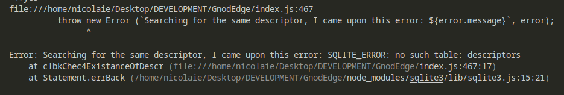
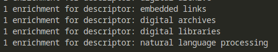
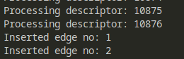
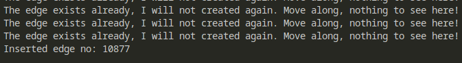
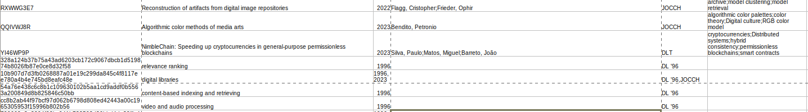
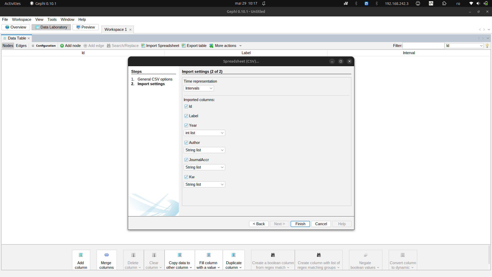
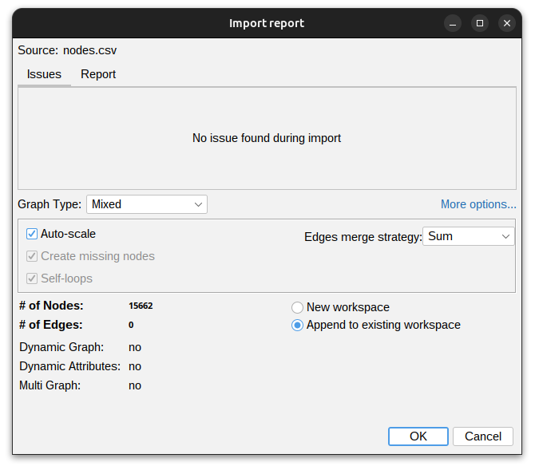

# Loading data in GnodEdge

For creating the necessary data, I follow the guide presented by Clement Levallois here [5 methods to create and import networks in Gephi](https://www.youtube.com/watch?v=ltkzcSAStYo)

Data is loaded in the database launching the application from terminal with `node app.js`. Mind that sometimes, if you re-run the app after you have deleted the `articles` and `descriptors` tables, the app might complain with possible messages like the following.

In this cases, do not fret. Just re-run te app. The missing table will be taken care of.

The first thing that the app is doing is to investigate if the table `articles` exists. If it exists, ask user if she/he wants to wipe clean the data from the table. If it doesn't exists, the table will be automatically created and populated with the source data file from the subdirectory `sourcefile`.

After the creation of the descriptors table and the first wave of edges, the app must be run again from terminal with `node index.js` to proceed with enrichment of descriptors and creating a second round of edges. Bellow there is a visual confirmation that the first round is going well.

Enrichment is finished and the edges are created.

After the first round is finished, you need to re-run the app to create the supplementary edges.

Having already installed TablePlus, you open the `publication.sqlite` file and check for data. From this app you may export the needed CSVs to start working in Gephi.

Observe that it follows the CSV variant you feed the app. Rearrange the columns in such a way that it satisfies the format Gephi is expecting. The ids are the `zotkey` column form the source file, being the key I obtained at the export of the data from Zotero.

In the end, the nodes CSV will be a merger between the `articles` table and the `descriptors` table. I have saved both of the tables as CSV with the help of TablePlus for convenience. I've merged them as described in the following picture using LibreOffice Calc. You may use Excel.

After the merger, save a new file as CSV.

Observe the `Year` as `int list`, `Author` as `String list`, `JournalAccr` as `String list`, and `Kw` as `String list`.

Another important thing is to append to the existing workspace.

For the rest, follow the steps given in the video Martin Granjean offers to you at https://www.youtube.com/watch?v=GXtbL8avpik.

For those of you who would lite to go through the main concepts, there is a very good mini series (Introduction to Social Network Analysis) here offered by Martin Grandjean: https://www.youtube.com/watch?v=lnLW6ITFY3M&list=PL4iQXwvEG8CQSy4T1Z3cJZunvPtQp4dRy
