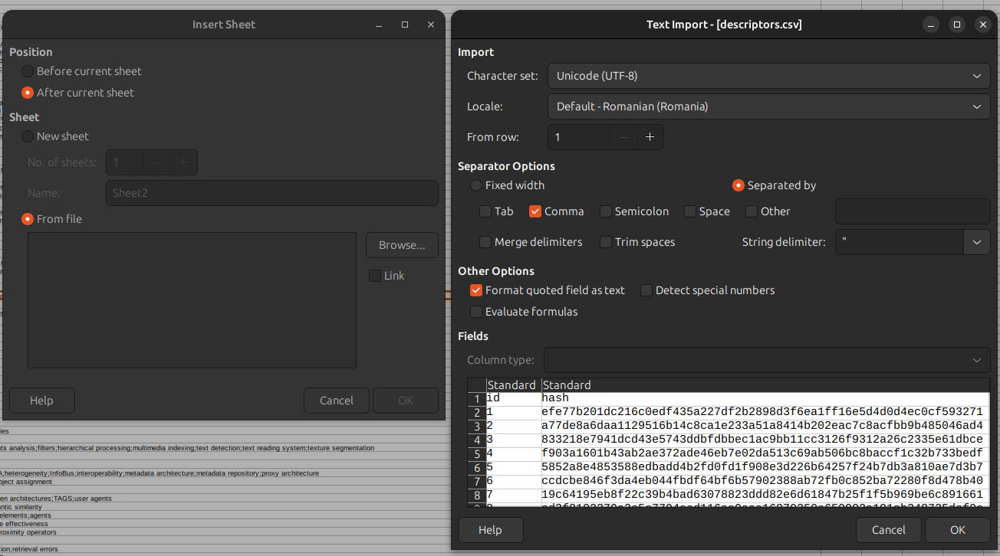
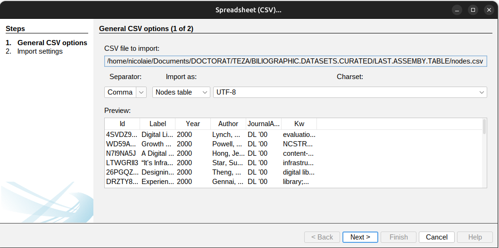

# How to work with GnodEdge

The first thing you need is to have your data put in the subdirectory sourcefile. There is a file in the subdirectory to guide you.

Run the application once to create the entities in the table `articles`. This is achieved issuing the command `node app.js` in terminal. The best way to work with the app is to open it in VSCode. It has a very potent Terminal and you also may investigate code, resources, etc.

The app will generate the info shown in the screenshot above and briefly after if prints `I've finished reading the CSV. Data is still being written in the articles table`, the app will cease execution and the prompt will be returned for another command in the terminal.

It is time to take a first peak at the database to confirm the `articles` table being created and hydrated with data.

Open TablePlus application and connect to the database.

 

When you open it, you will be welcomed by the presence of four tables out of which only `articles` is populated.

Mind that table sqlite_sequence is created by the application and cannot be deleted.

Now, if anything went wrong, just delete the `articles`, `descriptors`, and `edges` tables, solve the issue (probably data related), and give it another run issuing the same command: `node app.js`. 

The rows in the tables will become the working entities of the application. These entities will be considered the nodes in the future network. In the end the data from the two tables: `articles` and `descriptors` needs to be merged together in one table saved as CSV.

Now that you have `articles` table in place, you need to re-run the app to insert data into the `descriptors` table and data in the `edges` table. These data tables are not hydrated with data at the first run.

If all went according to plan, run again the application with `node app.js` in terminal. This is needed to create the `descriptors` table, and the `edges` table.

What happens behind the scenes is that first, the tables are created. Then the `articles` table is investigated in order to extract all the terms existing in the `Kw` column. Every individual concept becomes an entity/row in the table `descriptors`. Based on the information existing in `articles` table, and `descriptors` table, edges will be created and inserted as rows in the `edges` table. As the operations go, which, by the way, are very resource hungry, you will be presented in the terminal with rapid successions like those snapshoted for boosting your morale at this stage.

In the end, provided all went 🍑y, you will be presented with a summary like in the following screenshot

All you have to do now is to rip the benefits of your hard work, lovely 🦄. Go to the TablePlus application and export the the generated tables as CSVs in a place where you will work to join them together.

I cannot emphasize the need to curate well the bibliographic data you gather. A little scary thing. In my case, after processing the `articles` table, one keyword was actually an empty string. What this generated is a little nightmare. Look at the following. In the `descriptors` table, I have identified the creation of an entity based on an empty string (keword value).

This, in turn has generated three edges in the `edges table that establish a relation between an article and a *nothing* 🤣. Look below:

For this reason, investigate thoroughly your data. It might project such deviations skewing your result in Gephi. For the case I presented you, I have to manually delete the descriptor for *nothing*, but most importantly, the edges it created. I deleted them in the TablePlus. Be very thorough. Watch for the 👻s in the source and in the final result.

The table of descriptors looks like this data wise:

The edges

Now, I feel confident. Let's join together the tables. First export the tables from TablePlus with the following settings:

Out of the `articles` table and `descriptors` table we have to create one called `nodes.csv`. I will use LibreOffice Calc. You do this with your tool of choice. As soon as I opened the `articles.csv` file, I saved it as `nodes.ods`, which is the native format of LibreOffice. This is necessary because we need to add the data of the second file.

Let's have a look.

See those pesky `"` and `[]` inherited from the data?! We need to make'em disappear. Just find and replace should do.
Select the colum `Author` and column `Kw` (use SHIFT) to make a replacement.
First replacement is of all `["` occurrences, then `"]`. replace them with nothing. Do not write anything in the replacement field. Replace after all the occurrences of `","` with `;`.

 Depending where you started to make the selection, you may check the `Replace backwards` thick box.

The data for the both columns should be in this state:

I guess you have already spotted the fact that it looks like the data you originally saved from Zotero. the multiple values of one cell being separated by a `;`.

Create a new sheet and import the `descriptors.csv` file.

See that the new sheet is named descriptor.

Reformat the columns `Years` and `JournalAccrs` just like the last time observing the differences. You should arrive to the following result.
 

Now, carefully copy the data from the colum `hash`, `descriptor`,  and `Years` from the `descriptors` sheet to completing the column `Id`, `Label`, and `Year` from the `articles` sheet. The column `JournalAccrs` from `descriptors` under `JournalAccr` from the `articles`.

You should arrive to the following

We are not finished yet. Now, save it as `nodes.csv`. Remember to opt for `Edit filter settings` from where you opt to flank every cell with `"` (*Quote all text cells*). Now, you should have a priceless prize in your folder. Two files hundreds of hours of preparation worth: `nodes.csv` and `edges.csv`.

❤️ ❤️ ❤️ 

Now to the Gephi application and create a new project.

As fast as can, run to the *Data Laboratory*, make sure you are on the *Nodes* tab (should be greyed out) and choose Import Spreadsheet.

The `edges` table is imported in Data lab as is. Follow the next steps.

Check the settings for the columns. This is very important to avoid any errors. Secret is *String list*.

Then, import the edges moving to *Edges* tab.

Provided all went well, pressing the button *Overview* from top left, you arrive at the square of dread 🤣. Well done! You deserve a 🍸!

Have fun! Happy analysis.