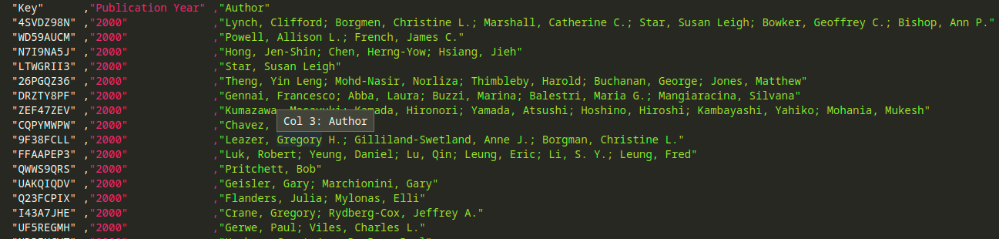
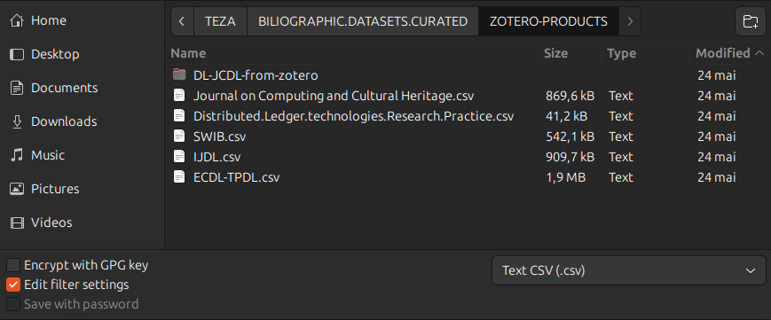
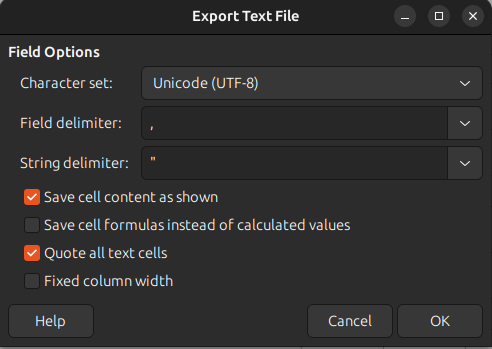
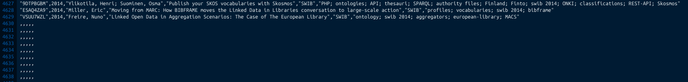
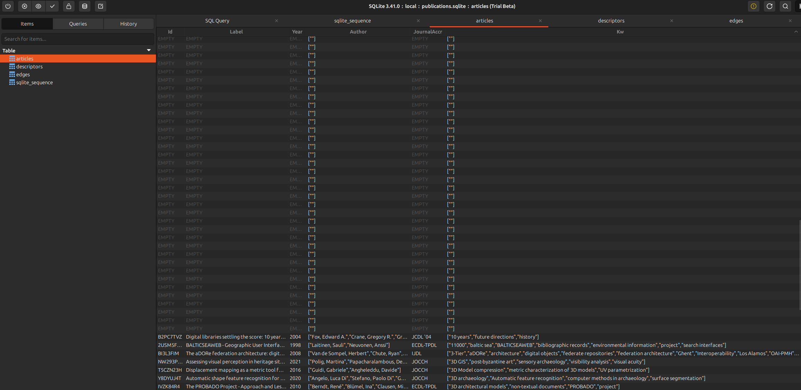

# Preparing data

This is the first and most important stage. Any deviation and the result is forfeited at the runtime of the application.

There is a sample dataset in the sourcefile subdirectory for you to have a minimum experimental data to go with. Mind that the set is the result of 10 months of collecting and annotation of venues in the field of digital repositories and digital libraries. Treat it with care and respect for the uncountable hours spent in collecting and curation. You are welcome.🦄

This application is set to use the data put together in this strict form. The header should have the following columns defined:

```text
Key","Publication Year","Author","Title","Series","Manual Tags"
```

This is the result of exporting data as CSV from Zotero where part of the data is aggregated. Mind that when you export from Zotero, you get a lot of other columns you must discard manually. Some supplementary data was added at a latter stage when the dataset was put together for a final massage.



A clean form should be preferred even if will take you some time to format, curate and clean the data. This is a very important stage. Do not treat it lightly. The image is a capture from MS VSCode with the following plugin installed: Rainbow CSV.
If you are not sure about your data, there is a plugin for VS Code called CSV Lint. Give it a run. As a rule of thumb, after you do all you cleaning with the package of your choice, save the CSV with all the cells wrapped in double quotes. I did my arrangement and cleaning with LibreOffice Calc. At the save as moment, for the CSV I've ticked on the option for Edit filtering settings.



And choose Quote all text cells.



I gave you these directions because I want you to be successful in preparing your own data.

The very that will ruin your day 🔥 is not to check for trailing empty rows at the end of the resulted CSV file. Because you are working hard in MS Excel or LibreOffice Calc, it might be possible to forget that at the end of the rows you might have empty rows. This will ruin your day at the application runtime. It will crash, and you will taste despair as I did. So, peal of 🍌 and investigate in a text editor for the following trailing artifacts before starting the app.



Now, another ruining event might be sparse data. I've got that because I have included scientific artifacts that didn't had authors or were not annotated, hence no keywords/descriptors present. Sparse data is not accepted. All cells must have values, because are transformed in working entities at app runtime. Do not treat this lightly. It will result in inconsistent data, and yielding errors.

Take a look at the second ruining day moment in the next screenshoot:

 

Believe me there is a lot of pain behind it. ☮️

After you have your CSV file, put it in the `sourcefile` subdirectory and call it `data-adoua-forma.csv` if you are very lazy. If not, open the code of the file app.js in the root project, and at the line 28-ish (in time might vary slightly due to development) find the variable that holds the name of the file: `let sourcefilename = `./sourcefile/data-adoua-forma.csv`;`. Modify this line according to your own preferred name of the file.

You are a great, lassie!

Now, lad, all this is behind you? Get 🍑y! Step to the operations document: [](../DOCS/operations.md).