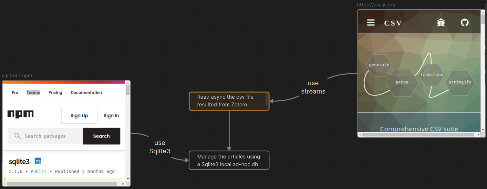

# GnodEdge

Creator of nodes and edges for Gephi

Purpose: the app is built out of the need to shape bibliographic data in such a way to be fast compatible with Gephi application. The purpose is to create the nodes table and the edges table very fast out of data saved from Zotero and cleaned a bit afterwards. For a good measure, take a look at the data-prima-forma.csv file to understand the reduced shape of the data.

Requirements:

- Install Obsidian from Obsidian.md. Create a new vault having the subdirectory gnodedgeplan as target. Opening Obsidian, you get a visualization with the planned steps in application development;
- Ensure you have Node.js version 20.2.0 (i suggest installing with nvm);
- Create a file in the root of the project called publications.sqlite. This will be the Sqlite3 database.

Important note: This is work in progress. The first stable app will be marked by the first release. This application is as it is. I do not guarantee for the safety of your data. It is a well behaved application, but let nt sleep on that, shall we?!

Details for using the app, in this section of the documentation: [loadingdata](DOCS/lodingdata.md).

(Teza UnitBv)
