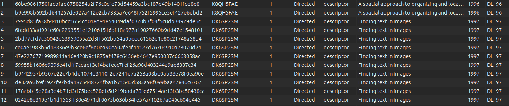
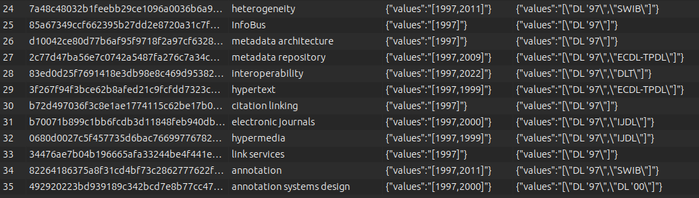

# GnodEdge

This is an application targeted at creation of nodes and edges out of bibliographical data. The resulting data refinement aim to become the imported nodes and edges for Gephi.

Purpose: the app is built out of the need to shape bibliographic data in such a way to be fast compatible with Gephi application. The purpose is to create the nodes table and the edges table very fast out of data saved from Zotero and cleaned a bit afterwards. For a good measure, take a look at the `data-prima-forma.csv` file to understand the reduced shape of the data from the extensive version that Zotero is producing.

The relations targeted are those established by the articles (as entities/nodes) and the keywords (concepts/indexing descriptors). Mind that the relation between a descriptor of an article has a weight of 1 hard setted in the code. The relation is hard coded as `Directed` because the descriptor point always to the article it *describes*. The following picture gives a perspective on what is the goal of this app.

The descriptors which are also distinct entities (nodes) are in the following form. Mind that the `Years` and `JournalAccrs` are stored as JSON.

In a future version I will find an optimization to create a set of nodes that finds the links betwwen the articles via the descriptor (*verb*). And futher in time the complex relations with the authors.

Requirements:

- Install Obsidian from Obsidian.md. Create a new vault having the subdirectory gnodedgeplan as target. Opening Obsidian, you get a visualization with the planned steps in application development;
- Ensure you have Node.js version 20.2.0 (i suggest installing with nvm);
- Create a file in the root of the project called publications.sqlite. This will be the Sqlite3 database.

Details for setting up the data and following the stages of refining it into nodes and edges, here: [loadingdata](DOCS/lodingdata.md).
Details for using the app, in this section of the documentation: [operations](DOCS/operations.md).

This is version 0.0.1, the first one. If time allows it, it will be improved and maybe an interface. Now you have all you need to make anetwork of scientific papers. This application is as it is. I do not guarantee for the safety of your data. It is a well behaved application, but let's not sleep on that, shall we?!

(Teza UnitBv)
